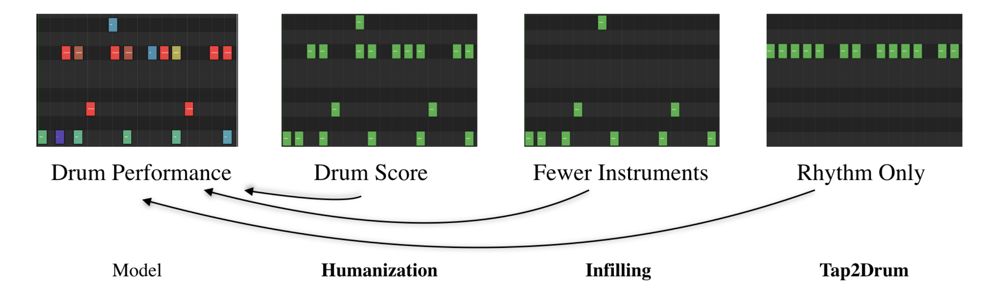

# BossaGroove :drum:

## Overview

This repository contains code for training and evaluating a neural network model for drum humanization(see image below). The goal of the project is to generate MIDI performances from quantized drum patterns that mimic the nuanced timing and velocity variations of a professional Bossa Nova drummer performance.



## Features

- Preprocessing: Maps drum hits to canonical categories, partitions sequences, and applies fixed-size windows for pattern creation.
- Data Representation: Represents drum patterns using binary matrices for hits, continuous matrices for timing offsets, and velocities.
- Models:
  - MLP (Multilayer Perceptron): Utilizes concatenated matrices of hits, timing offsets, and velocities as inputs.
  - Other models (to be added as developed).
- Training: Implemented using TensorFlow with the Adam optimizer.
- Evaluation: Assessing the generated MIDI performances for realism and fidelity to input patterns.

## Installation

1. Clone this repository:

   ```bash
   git clone https://github.com/your-username/drum-humanization.git
   ```

2. Install dependencies:

   ```bash
   pip install -r requirements.txt
   ```

<!---

## Usage

1. Prepare your drum pattern dataset according to the specified preprocessing steps.
2. Train the model using the provided scripts or train_custom.py for custom configurations.
3. Evaluate the trained model using evaluation scripts.
4. Generate MIDI performances from input drum patterns using the trained model.
-->

## Directory Structure

- `data/`: Contains datasets and preprocessing scripts.
- `models/`: Trained neural network models.
- `outputs/`: Model predictions and midi outputs
- `ml.py`: Script for training the model
- `midi.py`: Script for generating midis from model outputs
- `analysis.ipynb`: Model outputs exploration

<!---
- `utils/`: Utility functions and helper scripts.
- `train.py`: Script for training the model.
- `evaluate.py`: Script for evaluating the model
- `generate_midi.py`: Script for generating MIDI performances.
-->


## Contributing

Contributions are welcome! Feel free to open an issue for suggestions or bug reports, or submit pull requests for improvements.

## References

1. Gillick, J., Roberts, A., Engel, J., Eck, D., & Bamman, D. (2019). Learning to Groove with Inverse Sequence Transformations. *arXiv.org*. [Link](https://arxiv.org/abs/1905.06118)

2. Groove MIDI Dataset. (2019). Magenta. [Link](https://magenta.tensorflow.org/datasets/groove)

